[**ASOS**](https://www.asos.com) is the undisputed champion of online fashion, boasting over 50,000 branded and own label product lines across womenswear, menswear, footwear, accessories, jewellery, and beauty.

Its online platform works by choosing the best fashion items from a variety of brands and grouping these items with the company’s products.

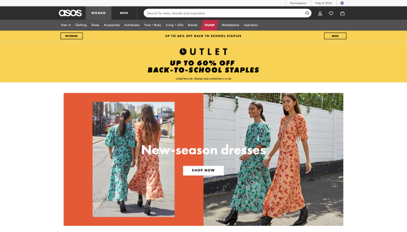

Then, the optimization of ASOS’ platform (or any e-commerce company) is highly essential. Minor UI changes can taper the conversion funnel and cost millions in losses to the company.

---

### Challenge

The numerous **product images** closely connect to the ASOS conversion rates.

[MIT neuroscientists](http://news.mit.edu/2014/in-the-blink-of-an-eye-0116) proved that the brain can identify images seen for as little as **13 milliseconds**. This greatly illustrates the importance of optimizing product images!

Furthermore, an excellent visceral design makes us feel at least something, hopefully making us happy and ideally getting us excited. In his book _Designing for Emotion,_ Aarron Walter explains that we know ourselves so well that **we try to relate everything we see** to ourselves.

> We know ourselves so well that **we try to relate everything we see** to ourselves

Therefore, each product image (including both the product and the model) tells a unique story and waits for a user to relate to it. These images build a strong and lasting connection between the user and the brand.

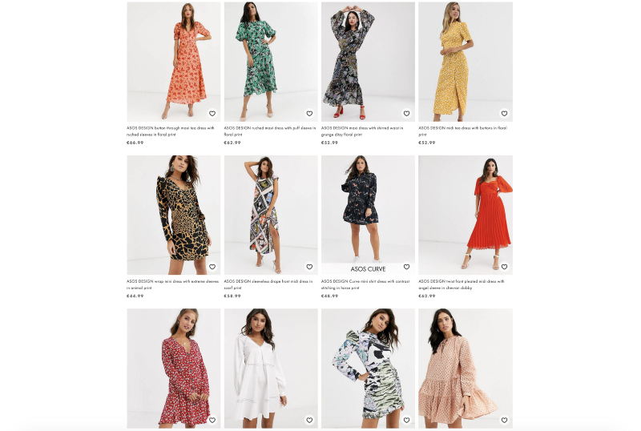

Thus, our challenge is as simple as that:

> **Which product photo is the most engaging to optimize the customer buying process?**

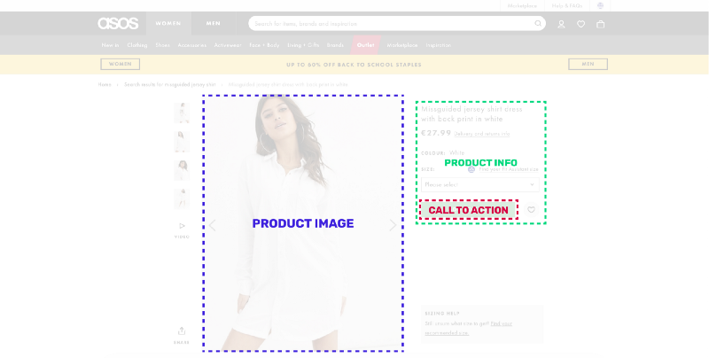

The goal is to find out which **product image** increases the attention of the _ADD TO BAG_  call to action button along with the product visibility itself.

The product under investigation is the following:

👗 [Missguided Jersey shirt dress in white](https://www.asos.com/missguided/missguided-jersey-shirt-dress-with-back-print-in-white/prd/13172775?clr=white&colourWayId=16483039&SearchQuery=missguided%20jersey%20shirt)

---

### Traditional Method

Usually, the process includes User Testing or A/B testing by sourcing people from an external tool like [UseBerry](https://www.useberry.com/), [UserFeel](https://www.userfeel.com/?gclid=CjwKCAjwnf7qBRAtEiwAseBO_OKCyXrINfklQG-hbPPWyWrPfQeE9z2KyT3l3Hf5Ig6gLIuAFGT0QxoCyrMQAvD_BwE) or [UsabilityHub](https://usabilityhub.com/), or by gathering your unbiased colleagues’/friends’ feedback.

We’re going to focus on A/B testing because it’s an excellent way to measure user response to small tweaks. A/B testing provides clear, quantitative results when conducted successfully.

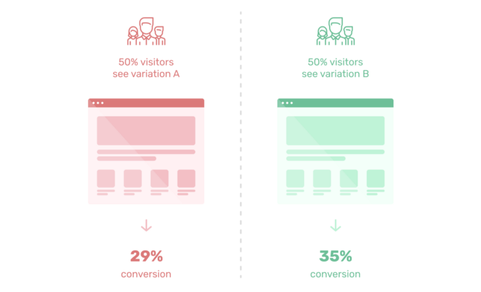

However, there are two primary **bottlenecks**:

-   The amount of audience sourcing required.
-   The time it takes until the results are available.

---

### New Method

Let me introduce you the successor of traditional A/B testing!

Me introducing predictive design to your design process.

The method is called **predictive design:**

> Predictive design is a commonly used statistical technique to predict future behaviour. Predictive design solutions are a form of data-mining technology that works by analyzing historical and current data and generating a model to help predict future outcomes. In predictive design, data is collected, a statistical model is formulated, predictions are made, and the model is validated (or revised) as additional data becomes available.

Learn more about it [here](https://uxdesign.cc/how-ai-will-enable-predictive-design-in-creatives-267e7d28fd32) 👈

```
Do you like it so far?! I appreciate claps 👏👏👏
```

---

### Solution

We’re going to use a new predictive design tool called [**VisualEyes**](https://visualeyes.loceye.io/). The tool gets an image as input and generates an Attention Heatmap. It helps us understand the correlation between user attention and, in this case, the product image.

All we need is a prototyping tool like Sketch, AdobeXD or Figma and use the corresponding plugin. The tool gives us the following results:

1.  **Attention heatmaps** that depict where the users’ attention goes.

2\. The [VisualEyes](https://visualeyes.loceye.io/) plugin allows the definition of a polygon **Area of Interest (A.O.I.)** inside your design that measures the average attention.

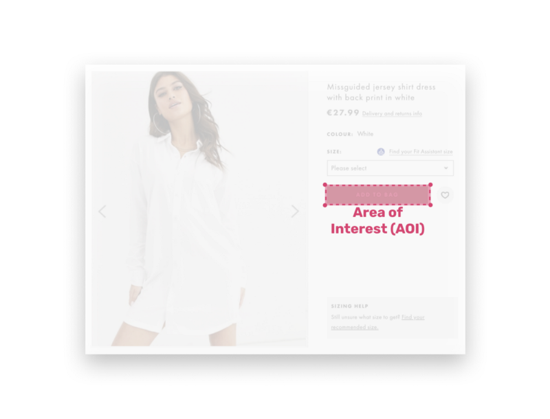

### Product

The choice of this product is not a random one. The absence of a brand and the placement of the model will help us generate some mind-blowing results.


For each variation, we define the following three Areas of Interest (AOI) around:

1.  The  **Add to bag (red)** call to action button
2.  The product’s **additional information (green)** section and
3.  The **product (blue)** itself

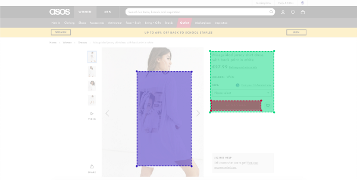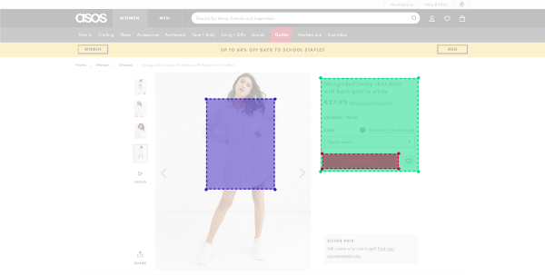

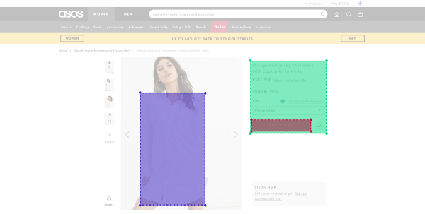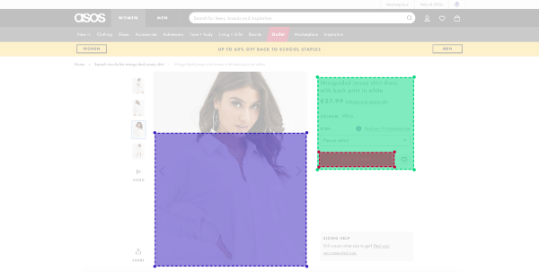

We use the [VisualEyes](https://visualeyes.loceye.io/) plugin and after 1**9 seconds,** the results are ready! ⏰

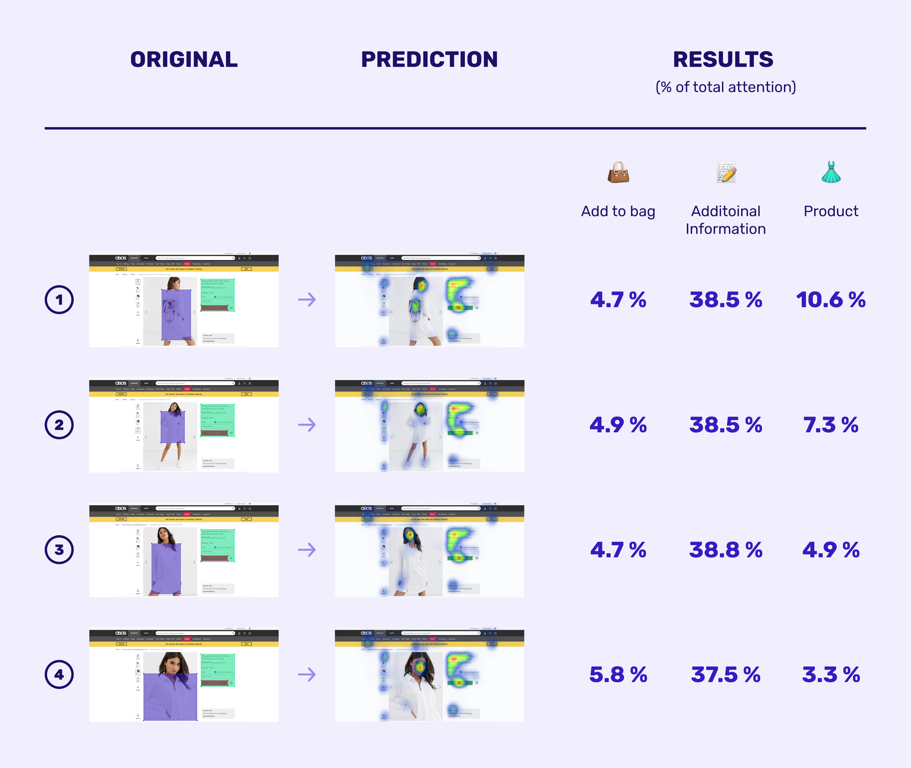

The winner of our A/B/C/D testing based on the results of VisualEyes tool is the **#1** product image.

The key point for our selection is the combination of product and Call to Action visibility. The first image scored the highest product attention by catching **10.6%** of the total customer attention.

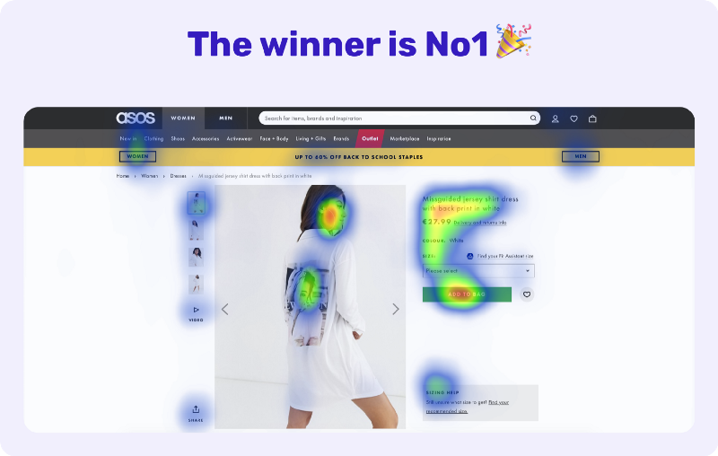

**However, why is that happening? The reason is quite impressive!**

User Experience designer A.Walter describes in his book _Designing for Emotion_ why we appreciate human faces so much. He explains that we are continually exploring the world around us by **looking for something familiar**. Familiarity gives us a feeling of comfort and reassurance. That’s the very first part of the subconscious process to capture your user’s attention.

Once you have caught your visitors’ attention, human faces are a great way to also **guide their line of sight**. This is happening because we are curious by nature and if other people look at something, we want to know what it is they are looking at.

The product image #1 is a textbook example of guiding the user’s gaze. In our case, this is employed to point the user towards the additional information of the jersey shirt dress and eventually lock her/his attention on the Call To Action button. The user’s attention has been subconsciously captivated and guided towards a button that prompts him/her to buy.

Last but not least, the winner image demonstrates precisely the [Hick’s Law](https://lawsofux.com/hicks-law.html).

> The time it takes to make a decision increases with the number and complexity of choices.

The winner image simplifies the user choices by breaking down complex tasks into smaller steps. The **user flow** starts by looking at the product itself and continues to the model’s face whose line of sight guides the visitor to the additional information section. Subsequently, the user ends up in the _Add To Bag_ button.

The designers at ASOS **hacked** the buying decision process of the customer victoriously! 🏆

### Conclusion

The main takeaway for me is the **importance of product images** for any e-commerce company. These companies ought to understand the effect images have on the user and spend an adequate time optimizing them.

The benefits not only can increase the attention to a specific element of the user interface but also make the customer **relate to the product**. Hence, the customer forms a special bond of trust with the brand itself. Once a consumer bonds to your brand, they’re more likely to make recurring purchases with no hesitation, which then bridges the gap between trust, loyalty and brand recall.

#### **Can predictive design be considered a panacea?**

> Have you ever heard people refer to themselves as “Apple people,” “Nike people,” or “Trader Joe’s” people?

This is what **brand awareness** can do for a brand: embed itself into people’s lifestyles and purchase habits so that consumers don’t have to think twice before becoming a customer, time and time again.

Brand awareness influences customers’ decision making subconsciously. It doesn’t mean that the **13 milliseconds rule** or the **lust for familiar content** don’t apply to these users too, but the emotional effect on their buying decision process is waning.

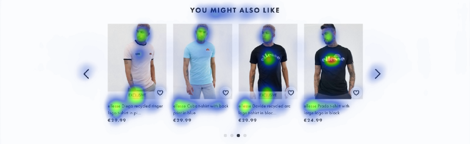

This is where predictive design currently fails but I firmly believe that running your predictive design tool with custom demographics will soon be available and will completely change the way people think about design.

As the famous Chinese-American machine learning scientist, _Andrew Ng_ quoted:

> It is difficult to think of a major industry that AI will not transform. This includes healthcare, education, transportation, retail, communications, and agriculture. There are surprisingly clear paths for AI to make a big difference in all of these industries.

**AI** will transform the **design industry** really soon!

---

### If you enjoyed this story, click 👏 . Thanks for the support!


Connect with me on: 🐦 [**Twitter**](https://twitter.com/d__raptis)**, 🏀** [**Dribbble**](https://dribbble.com/dmraptis)**,** 👔 [**LinkedIn**](https://www.linkedin.com/in/dimitris-raptis-a7088b132/)

---

🔗 **References:**

-   [http://news.mit.edu/2014/in-the-blink-of-an-eye-0116](http://news.mit.edu/2014/in-the-blink-of-an-eye-0116)
-   [https://usabilla.com/blog/effect-human-faces-web-design/](https://usabilla.com/blog/effect-human-faces-web-design/)
-   [https://www.smashingmagazine.com/2012/04/building-emotion-into-your-websites/](https://www.smashingmagazine.com/2012/04/building-emotion-into-your-websites/)
-   [https://togetherincredible.com/pros-and-cons-of-our-top-4-user-testing-methods/](https://togetherincredible.com/pros-and-cons-of-our-top-4-user-testing-methods/)
-   [https://blog.hubspot.com/marketing/brand-awareness](https://blog.hubspot.com/marketing/brand-awareness)

Special thanks to [Nikolaos Paschos](https://medium.com/u/a9da6ebe36a) for his review 👏

[](https://muz.li/?utm_source=medium&utm_campaign=gif-banner)
