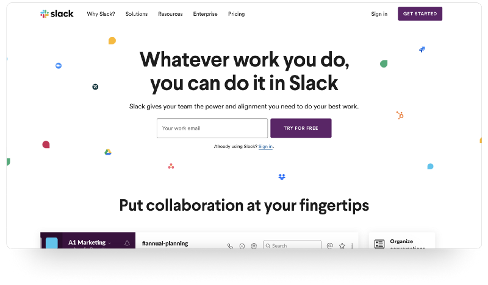
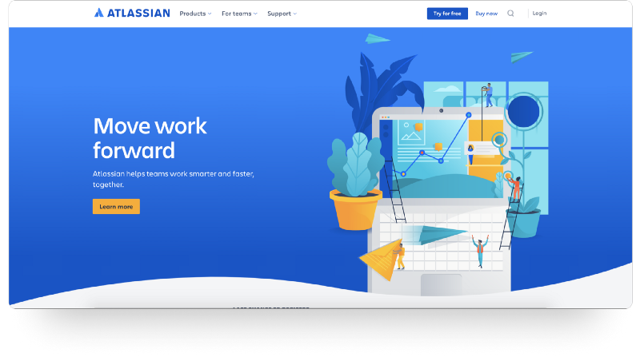
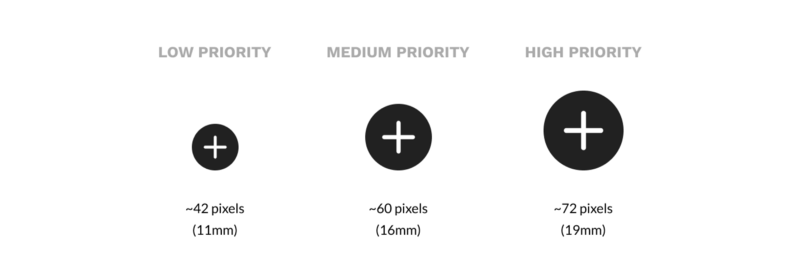
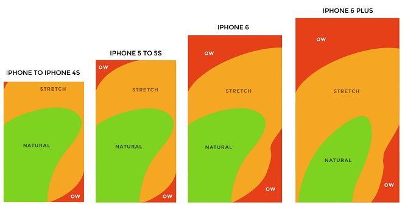
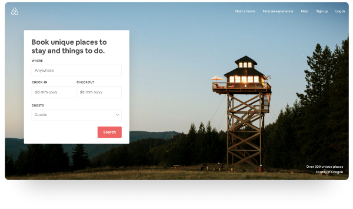
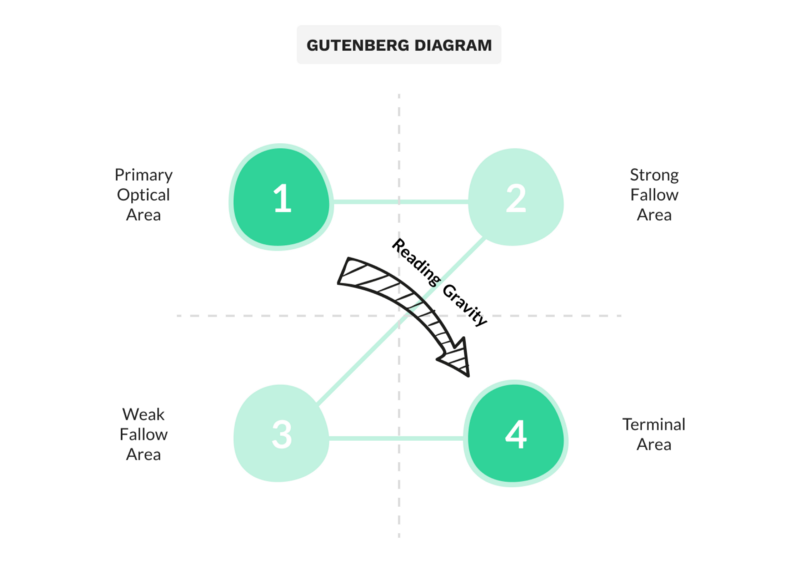

Digital products are competing for users’ limited attention . The modern economy increasingly revolves around the human attention span and a single element can make the difference. That’s why Call to Action buttons play a fundamental role in every user interface.

For anyone who is not familiar with the marketing term, here is a brief explanation from [Investopedia](https://www.investopedia.com/terms/c/call-action-cta.asp):

_A_ **_Call to Action (CTA)_** _is a marketing term that refers to the next step a marketer wants its audience or reader to take. The CTA can have a direct link to sales._

> To put it simply, your CTA is the action you want your website’s visitor to take.

.](./asset-2.png)

Let me guide you through some tips to overwhelm the most common pitfalls along with a few descriptive examples that analyze how attention works.

---

### Compelling copy

The power of words is marvelously illustrated [by Brian Clark of Copyblogger](http://www.copyblogger.com/the-two-most-important-words-in-blogging/). Social psychologist Ellen Langer asked to cut in line at a copy machine. She tried three different ways of asking:

1.  _Excuse me, I have five pages. May I use the Xerox machine? — _**60% said OK**
2.  _Excuse me, I have five pages. May I use the Xerox machine because I’m in a rush? — _**94% said OK**
3.  _Excuse me, I have five pages. May I use the Xerox machine because I have to make some copies? — _**93% said OK**

The trigger word “because” is so powerful that it didn’t seem to matter that the “reason why” provided was something you might expect to hear from a four-year-old child.

The highlighted outcome is that certain words persuade people more effectively than others. By including specific words that involve emotion, you unlock the persuasiveness of your copy [according to experts](http://www.guilamuir.com/the-12-most-persuasive-words-in-the-english-language/).

For example, [Slack](https://slack.com) takes advantage of the double meaning of **free**! Not only free of charge but also freedom of movement and choice affect the subconscious user behavior.

Another strategy many sites utilize in their Call to Action copy is the tone of their message. Verbs of operating introduce a straightforward, action-oriented approach that triggers the user to take the particular action because they answer the basic question, _“Why should I click this button?”._

Most successful companies include phases such as **_Try It Free_**_,_ **_Learn More_**, **_Get Early Access, Get Started_** and many more, and increase conversions by adding value to the Call to Action copy.

I’ve jotted down a bunch of the common copy phrases along with some examples in [my previous article.](https://medium.com/@dmraptis/6-call-to-action-copies-that-convert-803f7332ecc5)

`Do you enjoy your time here? I really appreciate claps👏👏👏`

---

### Contrasting Color

Call to Action buttons are the best demonstration of the [**Von Restorff** effect](https://lawsofux.com/von-restorff-effect). The Von Restorff effect, also known as The Isolation Effect, predicts that when multiple similar objects are present, the one that differs from the rest is most likely to be remembered.

This is the most significant reason why you have to make your Call to Action button pop and stand out among your other buttons.

 plugin.](./asset-5.png)

Color is the number one factor that influences the Isolation Effect when it comes to buttons. Always try to make the primary action button more prominent by using a contrasting color to capture user attention.

Firstly, you ought to ensure your colors, visuals, and typography work hand in hand for your button itself as an element. Readability, legibility, and contrast are highly important and you should test them beforehand.

A great tool to assist you with contrast checking while designing is [Stark](https://www.getstark.co/) plugin.

!](./asset-6.png)

Furthermore, the methodology about contrast doesn’t apply only to the button element itself. A powerful Call to Action button should have adequate contrast and be prominent compared to the whole interface.

[Sketch app](https://www.sketch.com/)’s landing page is a perfect example that illustrates the importance of Call to Action contrast compared to the page’s content. Not only it respects the branding of their product, but it also managed to create a bold Call to Action button that attracts the majority of the visitor’s attention.

To put it simply in this occasion, the button cannot be missed!

 plugin.](./asset-8.png)

---

### Size Matters

Size & position play a fundamental role in Call to Action visibility and accessibility. A considerable amount of variables define the proper size of a button.

[Research](https://www.researchgate.net/publication/225367546_Touch_Screen_User_Interfaces_for_Older_Adults_Button_Size_and_Spacing) on button size and spacing has discovered a standard that works for most users, including the elderly.

The study indicates that the highest accuracy was found with buttons between **42–72 pixels**. This means that 42 pixels is the minimum and 72 pixels is the maximum button size that’s most optimal for users.

Large buttons grab the vast majority of the user's attention, leaving the user with no trace of what the service offers. This has a critical impact on the page’s content absorption. Whereas, making the button too small can seriously impact its accessibility. Few things are more frustrating than a button that is too small to press.

Mobile interfaces face another common issue. The term “[**Designing for Thumbs**](https://www.scotthurff.com/posts/how-to-design-for-thumbs-in-the-era-of-huge-screens/)**”** has been brought forward by Scott Hurff and should be highly considered. It means building interfaces that are the most comfortable to use within our thumb’s natural, sweeping arc.

Obviously, the Call to Action button should be comfortable to reach. Thus, considering the **Thumb Zone** **heatmap**, the designer can easily choose the most appropriate position for the Call to Action button. Inside the Natural Area of the application, the chances of the button to be pressed can be increased exponentially.

---

### Go with the Flow

The direct path that a user would follow while consuming the page’s content is highly important. By arranging your copy and buttons in a way that encourages a natural reading flow you can direct your visitors to your Call to Action.

The above statement is in line with the popular [**Fitt’s Law**](https://lawsofux.com/fittss-law)**.** The time to acquire a target is a function of the distance to and size of the target. Thus, by placing the Call to Action at the end of the user’s flow you eliminate the cognitive and physical effort to convert.

 plugin.](./asset-12.png)

By taking a close look at the attention heatmap, you should identify the most common eye-scanning pattern, **F-Shaped Pattern**. Recent [eye-tracking research](https://www.nngroup.com/articles/f-shaped-pattern-reading-web-content/) shows that the F-shaped scanning pattern is alive and well in today’s world — both on desktop and on mobile.

This fascinating reading pattern which depends more on human behavior than on technology indicates that the _“Search”_ Call to Action button could have been placed at the bottom left corner.

Here, the designers at Airbnb follow a different approach though. They take advantage of the **Z-Pattern layout** and the **Gutenberg diagram**. The Call to Action button is placed at the Terminal Area to abstract any distraction and encourage action.

When the user reaches the lower right portion of the form there is a break in the reading or “page scan” process and the user will need to take an action. This is the perfect place to insert Call to Action elements.

---

### Takeaways

In general, Call to Action elements have a tremendous impact on the company conversions and are correctly considered as the most important element of your interface. By keeping in mind some basic design principles you can make your Call to Action button stand out and grab the necessary attention it demands.

Reinventing the wheel is not necessary and sometimes the best way to get really good at something is to learn from industry leaders. Taking a closer look at the most successful digital companies and how they structure the content around their Call to Action elements will help you figure out the basic patterns that work.

---

### Thanks for your support!

If you enjoyed this story, please click 👏 👏 👏

_Chat with me on:_ 🐦  [**_Twitter_**](https://twitter.com/d__raptis)**_,_ 🏀** [**_Dribbble_**](https://dribbble.com/dmraptis)**_,_** _or_  👔  [**_LinkedIn_**](https://www.linkedin.com/in/dimitris-raptis-a7088b132/)

