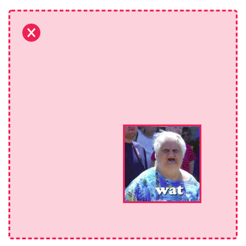
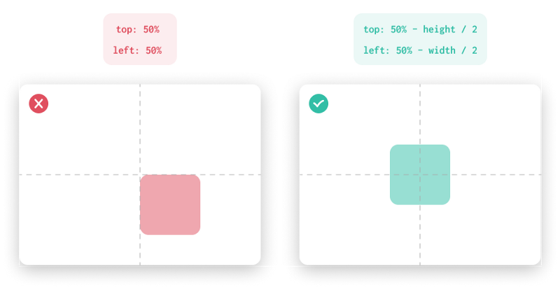

 on [Unsplash](https://unsplash.com?utm_source=medium&utm_medium=referral)](./asset-1)

**TLDR:**

Learn how to center an element with `position: absolute` inside its parent.

### Introduction

You should probably be thinking, _“Why not using the rad_`_display: flex_` _CSS rule?”_. And you’re right! In almost all cases `display: flex` could work and escape you from some unnecessary headache.

However, sooner or later you’ll need to hack the system and position a poor element using `position: absolute`. Then, maybe you’ll figure out that it’s a little tricky.

I’m here to rescue you, buddy‍!

### The Wrong Way

You open your favorite code editor(VS is mine) and the show starts!

You’re so much excited about your awesomeness until you look at the final result!

> No! God damn No! Dat thing is no waycentered!

And, that’s the exact time you wonder why you started coding in the first place. But as the curiosity takes place over the frustration, you start wondering: _“Why is that happening?”_

### The Correct Way

You (and obviously **I** when I first came into that centering issue) are missing a crucial detail! Considering a 2-D plane, the center point (0,0) of the coordinates system is not the center of your element. **It’s the top left corner!** Now it should make perfect sense why the item looked far from the center in the first place.

But how can you change that? **It’s a cinch** and I’m gonna show you the proper way.

The key point is to subtract the half of the element’s width on the X-axis (horizontal) and the half of the element’s height on the Y-axis (vertical). Then, your element has to be absolutely centered inside its parent.

The CSS implementation is even easier, thanks to the`**translate()**`function.

> _The_ `**_translate()_**` _function repositions an element in the horizontal and/or vertical directions._

Thus, by using `translate(-50%, -50%)` you’ve removed the undesired offset using only **21 characters**. Amazing!!! 👏

### Conclusion

When the Flexbox module is not an option, you should not be afraid to play with`position` property.

To be honest, I’d be really glad to learn even **more awkward ways to center** my boring elements. Feel free to suggest us some in the comment section below 👇

