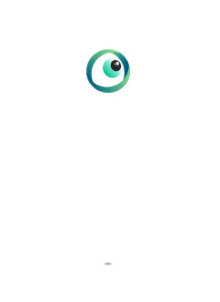

](./asset-1.png)

**TLDR:**  
Build a smooth bouncing logo animation with pure CSS and use it in React. My impatient friends can scroll down the dark depths (=end) of this article and grab the valuable CSS snippet.

### 👵 The Story

While I was craving for inspiration on Dribbble and cursing the trash Internet connection, I saw IT! It was small but beautiful! Μoving tirelessly back and forth and catching my breath every time it hits the ground.   
From that time on, I was obsessed with the small devil!

As a front-end engineer that respects himself, I opened the dev tools to check the source code of the animation. Who would have thought that it was **just a gif**?

I was really disappointed!

From that time on, I had my heart set on building the god damn bounce!

But, enough of my emotional breakdown. Let’s get some 💩 done!

### 🧠 How

Before getting our hands dirty, I want to define **our goal** and how we’re gonna achieve it!

First of all, the Dribbble logo is a basketball, so it makes perfect sense to be bouncing. However, it doesn’t have to be a ball to make the animation look natural. Having a circular shape is enough and in order to convince you our object will be an **eye**.

Wut???

My [startup](https://www.loceye.io) uses eye-tracking technology to measure viewability, and possible that eye thing makes sense now.

The second point is about the shadow! Maybe it’s not obvious to everyone but a bouncing eye transforms its shadow as it gets near the ground. The shadow gets bigger and bigger as the eye comes closer to the ground.

About the code implementation, we’re gonna need an **SVG logo** (PNG could work too with small adjustments) and a **basic understanding of CSS animations**. When we have a functional bouncing eye, I’ll show you how you can use it in any React project with no hassle as a loading component.

### 👨‍💻 Coding Section

Let’s start the coding section easily!

The idea behind the implementation is not rocket science! It works as simple as that. Define a container that will contain the logo and its shadow. The logo and the shadow will be positioned relative to their parent element.

For educational reasons, I’m gonna break down the whole animation concept into **4 parts**.

### 💀 Part #1 — Static skeleton

We’re gonna define the static layout of our animation. For simplicity, the logo and its shadow will be two `
` elements with circular and rectangular shape respectively.

Now, let’s declare some useful **CSS variables** and escape from the headache later. If you’re new into CSS variables and curious to learn more, you can visit [this link](https://blog.logrocket.com/how-to-create-better-themes-with-css-variables-5a3744105c74/) and thank me later at the comment section.

It’s time to position our main elements. The trick is the CSS attribute `position`. By defining `position: relative` at the container and `position: absolute` to its children, we achieve to position the ball and the shadow relative to their parent.

The tricky part here is to keep in mind that the `top` and `left` attributes calculate the absolute position of the top left element’s point.

For example, the elements can be horizontally centered inside the container if we set `left: 50%` and subtract the half of its width.

The CSS classes below align the ball and the shadow inside their container using some plain calculations.

By now, our animation should look more static than ever!

### 🏃Part #2 — Movin’ it

It’s time to move the damn ball!!!

Half the magic lies on the `**@keyframes**` CSS at-rule, which controls the intermediate steps in a CSS animation sequence by defining styles for keyframes (or waypoints) along the animation sequence.

Our `@keyframes bounce` at-rule is gonna handle the `translateY()` and `scale()` CSS functions.

The function `translateY()` will reposition the ball vertically on the 2D plane from `0` to`var(--drop-height)` pixels. Simpler, it will move our ball **downwards** towards the ground by the specified pixels.

But how? Here comes the rest of the magic! The `**animation**` CSS property applies an animation between styles. We set the`**animation-direction**` property alternating back and forth `**animation-iteration-count**` to infinite.

> **Smooth movement is anything and everything!**

However, the most important property is the `**animation-timing-function**`, that specifies how an animation progresses through the duration of each cycle. I picked the `cubic-bezier()` timing function because it’s highly customizable and can give the desired natural feeling.

Of course, these floating point numbers are not random but precisely defined after hours of calculations. Just kidding!

Hopefully, Andrey Sitnik and Ivan Solovev build an amazing curated list of easing functions, the [**easing.net**](https://easings.net/). My work was to pick easeInExpo  and copy-paste the `cubic-bezier()` easing.

Another great tool is  [**cubic-bezier.com**](https://cubic-bezier.com/) by [Lea Verou](https://medium.com/u/f641207306c2). Not only helps you visualize your cubic-bezier curve, but you can also compare it with some common easing functions.

### 🕶 Part #3— **Shadow** owes its birth to light.

It’s time to take care of our shadow. Considering our extended analysis on _Step #2_, the shadow movement should be easy as a pie (unless you’ve never baked a pie).

As you can see, our only adjustment is on its `scale()` function. Our goal here is to “stretch” the shadow as the ball is coming closer.

So far, we have a fully-functional bouncing animation with two dummy objects. Let’s put the finishing touches at our next step.

### 🏀 Part #4 —Dat eye is bouncing

Everything is great by now, but something is missing. The lovely eye and its realistic shadow of course. Obviously, a ball cannot have a rectangular shadow.

I used a `<svg>` element with our `.logo` class to define my logo.

However, it could work if you kept the `
` element and added a PNG image inside the `.logo` class, taking advantage of `background-image` property. Moreover, we should use `background-size` and `border-radius` to center it.

The last touch is adding the`radial-gradient()` function and create a fading natural shadow for our object.

### 🎉🎉🎉 Kudos! The logo is bouncing!

If you were here to **grab your CSS snippet**, the above Pen will make you joyful. Thank you for being patient with my bad sense of humor and hope to see you around here again!

---

The rest of you, who want the **React component** should bear with my cringe jokes a little bit more.

### ⚛ Only React geeks here

You should expect some more fancy code images, but I’m gonna surprise you, buddy. Get your valuable React component and the whole CSS file as two boring **Github gists**. I’m evil, yeah! 😈

About the React component, I took advantage of the powerful`[styled-components](https://www.styled-components.com/)` library, that allows you to write actual CSS code to style your components. Of course, you can use the traditional way and import your CSS file into your component.

A tricky point is that the `<Logo>` component is an `<svg>` element rendered as a React component. You can easily transform an `svg` element to React component using [**svgr**](https://www.smooth-code.com/open-source/svgr/playground/) web editor(CLI tool is available too). Don’t forget to include `viewPort` in your `<Logo>` component!

### 🏃‍♀️🏃 Impatient CSS lovers here

### Conclusion

It’s not that difficult to create a cool animation using pure CSS stuff. You should only **take a deep breath** and define what you really want! Transferring your animation to the real world can really help you understand the basic requirements!

Check the functional React Sandbox and I’m gonna wait for your dirty bouncing animation at the comment section below 👇👇👇

[**Bounce Animation - CodeSandbox**  
_Get your users amazed with neat bouncing animation 🔥_codesandbox.io](https://codesandbox.io/s/bounce-animation-fhf5o?fontsize=14 "https://codesandbox.io/s/bounce-animation-fhf5o?fontsize=14")

---

