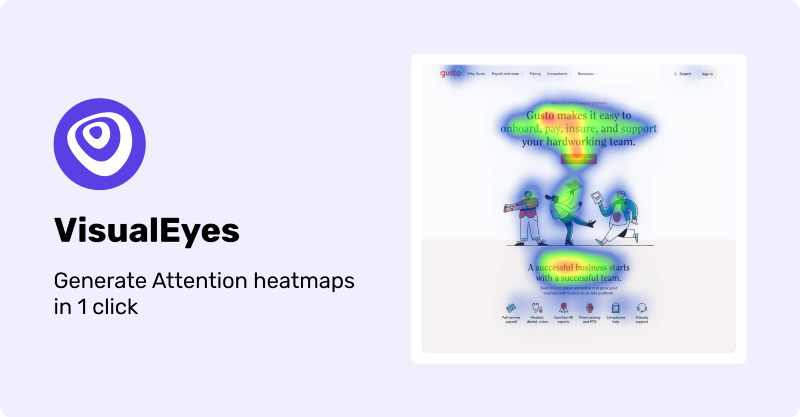
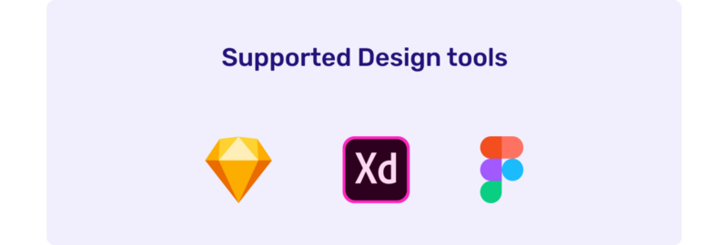
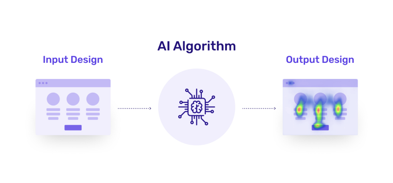

**VisualEyes** is a next-gen design tool that combines leading neuroscience research with AI to accurately predict how people will react to your digital designs.

### The time is now!

The Beta-testing era has arrived and you’re more than welcome to be a part of it.

Currently, we support the three main prototyping tools. **Figma**, **Sketch** and **Adobe XD** plugins have already been developed!

You can request Early Access to the plugins by visiting [our website](https://visualeyes.loceye.io/subscribe)! 🎉

### How it works

It’s simple as that:

**🔌 Input:**

The VisualEyes plugin uploads any kind or size of your design artwork to our platform.

**🧠 Algorithm:**

Our AI algorithm predicts the attention of users based on **_more than 20,000_** eye-tracking data gathered from [our platform](https://www.loceye.io) and open datasets.

**🏆 Output:**

You will receive a transparent (or with the original image as background) heatmap that displays the attention areas of your design.

### Examples

Still feeling confused?! 🤔

It’s time to give you some examples from the real world, that will help you fully understand the usage of our tool.

Below you can find the attention areas of some **popular landing pages** along with the original design:

[[Gusto’s original landing page along with the page after our attention prediction](./asset-4.png)](https://gusto.com/)[[Calibra’s original landing page along with the page after our attention prediction](./asset-5.png)](https://calibra.com/)[[Specify’s original landing page along with the page after our attention prediction](./asset-6.png)](https://specifyapp.com)[[Panda’s original landing page along with the page after our attention prediction](./asset-7.png)](https://usepanda.com/)[[Segment’s original landing page along with the page after our attention prediction](./asset-8.png)](https://segment.com/)[[DesignBetter’s original landing page along with the page after our attention prediction](./asset-9.png)](https://www.designbetter.co/)

### Conclusion

We are building a new design community and we would be glad to have you on board! Join in our [**official Spectrum chat**](https://spectrum.chat/visualeyes-designers?tab=posts)  and tell us your thoughts.

[isit VisualEyes website[VisualEyes clickable logo](./asset-10.png)](https://visualeyes.loceye.io/)
