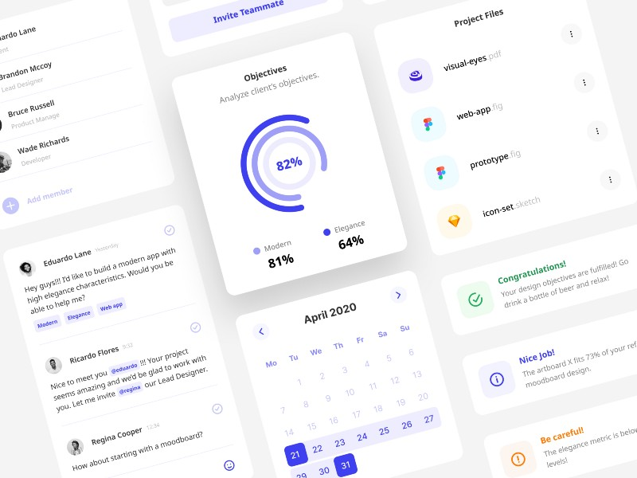
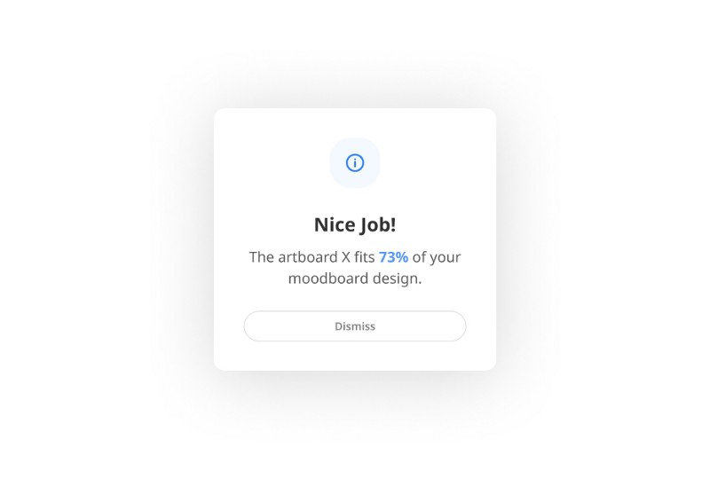
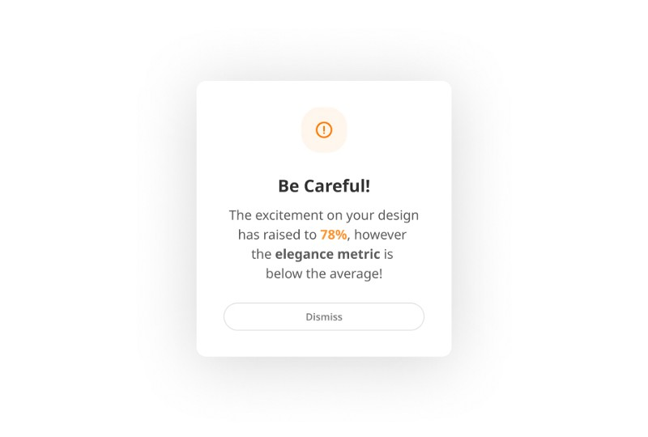
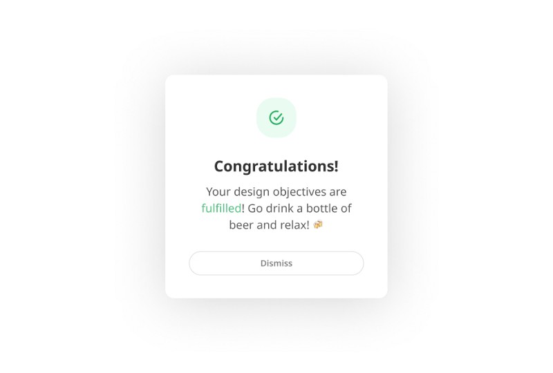
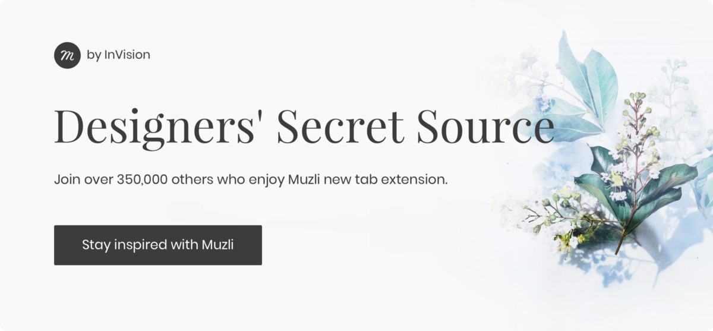

The design has evolved throughout 2019 with _collaboration_ and _automation_ being an unbreakable part of our processes. Even _AI_ started breaking into the design life with slow steps and gained a bit of popularity. On the other hand, the design field still remains the most chaotic and unstructured industry in terms of metrics.

Consider the **marketing life** for a while. A good marketer starts a campaign, sets the objectives, create the content and automates the publishing and evaluation flow. Then the campaign is launched.

The evaluation of the results is based on the outcome of A/B tests and the analytics metrics. The work is done and he can happily announce the conversions increase or the marketer admits the failure and starts over again.

> Why this cannot happen in design too?

### Imagine that!

You kickstart a new design project with your stakeholders. The stakeholders are not sure what exactly they want (pretty rare huh?! 😅 ). He wants a **modern** but **elegance** app that makes the user feel **excited** and **safe** at the same time.

Moodboards are still a thing so you create one about the X project. You add user interfaces of similar apps and create a typical color schema too.

The stakeholders go home and your responsibility is to make their partial idea come to life.

You open your favorite design tool and start wireframing and designing a couple of basic screens. 60 minutes later a popup appears:

You keep on designing with a smile on your face and try full **rounded corners** at your buttons. Another notification grabs your attention:

Then, you play around with your color palette. Black is the queen of elegance. Why not black as my primary color? Guess what, another popup dialog.

The next day, you meet with your stakeholders. You’re pretty nervous because you have to present your solution and they are picky.

> “This is not what I had in my mind at our previous meeting. However it seems to fulfill our objectives and works pretty well, so let’s give it a try!”

End of the imaginary story here.

#### Thanks for your support!

If you enjoyed this story, I’d appreciate your claps 👏 👏 👏

_Chat with me on:_ 🐦  [**_Twitter_**](https://twitter.com/d__raptis)**_,_ 🏀** [**_Dribbble_**](https://dribbble.com/dmraptis)**_,_** _or_  👔  [**_LinkedIn_**](https://www.linkedin.com/in/dimitris-raptis-a7088b132/)

