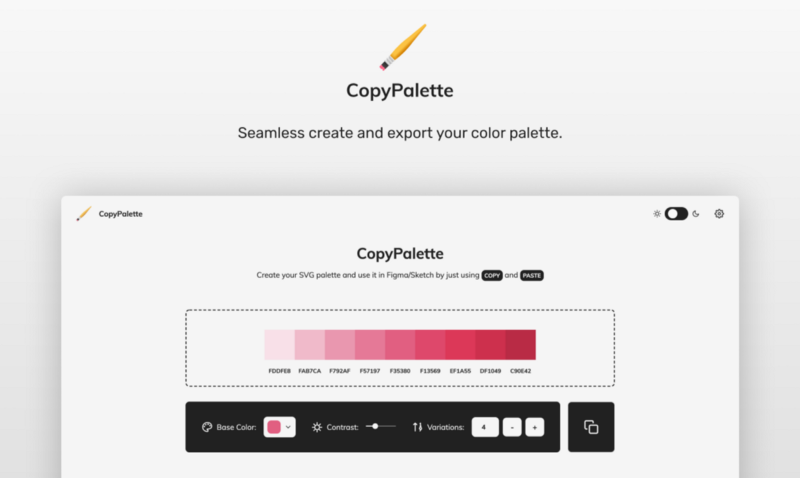

  

  

Long story short, never underestimate yourself!

  

### 👵 Story

The core functionality of the app was built in 5 hours! However, I never officially launched this app because I was afraid that it sucks! 😢

Almost 3 months later, I compulsively posted for feedback on [Reddit’s UI\_Design channel](https://www.reddit.com/r/UI_Design/comments/d5fhfr/feedback_for_my_new_color_tool/). The community overwhelming supported CopyPalette and within 2 days the app reached 2k hits (according to Google Analytics).

The tool went viral and was posted in major design channels like [DN](https://designernews.co), [Sidebar.io](http://sidebar.io/), [Prototypr](https://prototypr.io) etc.

Thus, I was exceedingly happy and decided to post CopyPalette on Product Hunt today. My aim is to reach 10k hits ⚽️

💡Idea:  
Every time I used to kickstart a UI design project, I had one repetitive struggle!

Defining the color palette should be easy a walk in the park! However, the joy of designing was camouflaged with unlimited copy-paste commands of HEX/RGB codes.

🎨 How:  
CopyPalette is a handy color tool that help you create and export monochromatic color palettes in a blink

The export format is SVG, therefore the copy-paste command works with all the current prototyping tools, including Sketch, Figma, and Adobe XD.

🔥 Features:  
\- Fine-tune your palette by handling contrast, steps and the base(=middle) color.  
\- Choose between 2 color palette appearances  
\- Toggle Day/Night mode  
\- Export in SVG format

🤖 Tech Stack:  
\- ReactJS  
\- Styled Components  
\- Material UI  
\- Netlify

I’d love to hear your feedback ❤️

Enjoy designing,  
Dimitris
