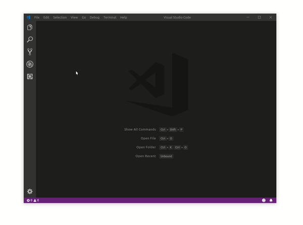

 on [Unsplash](https://unsplash.com?utm_source=medium&utm_medium=referral)](./asset-1)

Code productivity is an ultimate part of a developer’s life. Writing less code and staying clear of repeatable snippets will eventually result in being focused on the important part of software engineering. Don’t underestimate the benefits of your mental health, too.

> Writing less code and staying clear of repeatable snippets will eventually result in being focused on the important part of software engineering.

Lately, I started using **VS Code custom snippets** and it was quite a surprise that my productivity was extremely boosted 🚀

The exciting part is that you can dedicate **up to 1 minute** in order to set up your first code snippet. 😵

Yeah, you read that correctly! Just 1 MINUTE!

### 🏁 Let’s start

I’m gonna assume that _you’ve already defined the repeating code sample_, which will become our awesome VS Code snippet.

For me and the majority of front-end developers, **the creation of a stateless (or dumb) component** is a pretty de-facto programming chore.

### 1\. Define the core snippet

It’s super easy! The core snippet is the repeatable part of your code you’re willing to abstract. Component-specific functionality (e.g. variable names or string messages) should be removed.

Here you’ll only need the **skeleton** of your snippet.

---

### 2\. Find your tabstops

Firstly, what the heck is a **tabstop**?!

> Tabstop is the cursor location when you press the Tab key.

With tabstops, you can make the editor cursor move inside a snippet. Use `$1`, `$2`,etc. to specify **cursor locations**. The real fun is that multiple occurrences of the same tabstop are linked and updated **in sync**.

---

### 3\. Add variables

With `$name` or `${name:default}` you can insert the **value** of a variable. When a variable isn’t set, its _default_ or _the empty string_ is inserted.

🙋‍♂ ️**PRO TIP:**

VS Code provides some great [predefined variables](https://code.visualstudio.com/docs/editor/userdefinedsnippets#_variables).

_For example, the_ `**_TM_FILENAME_BASE_**` _autocompletes the filename of the current document without its extensions._

---

### 3\. Generate the VS Code snippet JSON

Snippets are defined in a pretty straightforward JSON format.

You can either convert your code manually or use [this](https://snippet-generator.app/) great tool build by [Pawel Grzybek](https://pawelgrzybek.com/). Snippet generator converts your code to VS Code, Sublime or Atom snippet!

The major attributes are the following:

`**prefix**:` type the snippet _prefix_, and press Tab to insert the snippet. In this case dumb_._

`**body**:` is the content and either a single string or an array of strings of which each element will be inserted as a separate line.

---

### 4\. Open the snippet config file

Select `User Snippets` under `File > Preferences (Code > Preferences on macOS)`. Then, you’ll be prompted to select the language scope for which the snippets should appear.

Our snippet is created for React Js so we’re gonna use `**javascript.json(Javascript Babel)**`  snippet file type.

Other option could be, `javascript.json(Javascript React)`. However, keep in mind that your snippet will be available only with `.jsx` extension.

🙋‍♂ ️**PRO TIP:**

I totally recommend setting `"editor.snippetSuggestions": "top"`, so your snippets appear above IntelliSense.

---

### 5\. Add your snippet

Just copy-paste your snippet inside the opened JSON file and save.

---

### 🤸‍♂️ Enjoy your snippet

Open a new `.js` file and type the prefix `dumb`.

---

### Are you lazy like me?

👉 You can find a curated list of useful React snippets at my personal [repo](https://github.com/dimitrisraptis96/vscode-react-snippets) 👈

[**dimitrisraptis96/vscode-react-snippets**  
_🧠 Skyrocket your VS Code development with some useful ReactJs snippets - dimitrisraptis96/vscode-react-snippets_github.com](https://github.com/dimitrisraptis96/vscode-react-snippets "https://github.com/dimitrisraptis96/vscode-react-snippets")

🔗 Useful links:

-   [https://github.com/dimitrisraptis96/vscode-react-snippets](https://github.com/dimitrisraptis96/vscode-react-snippets)
-   [https://code.visualstudio.com/docs/editor/userdefinedsnippets#\_variables](https://code.visualstudio.com/docs/editor/userdefinedsnippets#_variables)
-   [https://snippet-generator.app](https://snippet-generator.app)
